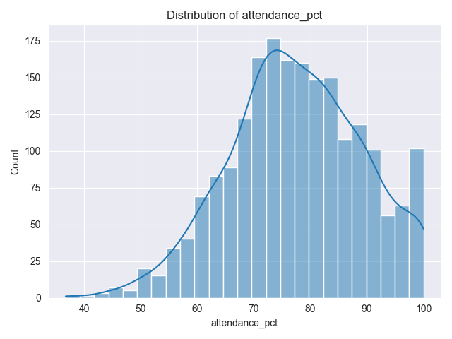
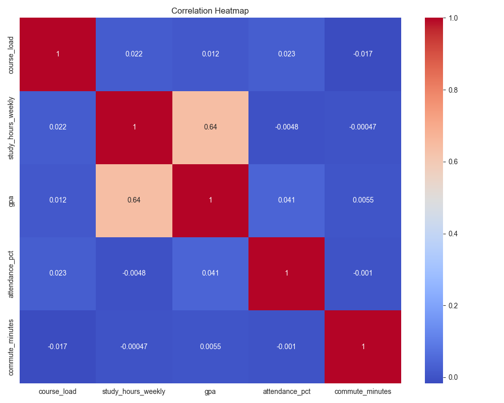

# Student Performance EDA — Findings

## 1. Dataset Overview
The dataset contains student academic performance information including GPA,
study hours, attendance, department, internships, and scholarships.

Missing values were handled as follows:
- commute_minutes: filled using median imputation
- study_hours_weekly: rows with missing values removed
Shape: 
(2000, 10)
coloumns:
student_id                str
department                str
semester                  str
course_load             int64
study_hours_weekly    float64
gpa                   float64
attendance_pct        float64
has_internship            str
commute_minutes       float64
scholarship               str
dtype: object
notable data quality issues :
there is a two missing values cloumns (commute_minutes and scholarship) we handle it as we sayed above 
--here is a full data description in (see )
---

## 2. Distribution Insights

- GPA distribution appears approximately normal.
(see  )
- Study hours show *moderate variability* with slight *right skewness*, indicating a smaller group of students studies substantially more than average.
(see output\study_hours_weekly_distribution.png)
- Attendance percentage is generally high across students.
(see )
- Box plots comparing GPA across departments show overlapping ranges and similar medians, suggesting comparable academic performance between departments.
(see  )
- Box plots and violin plots comparing GPA across departments show
overlapping ranges and similar medians, suggesting comparable
academic performance between departments.

The violin plot additionally reveals the full distribution density,
confirming that GPA values follow similar shapes across departments
and that no department shows a distinctly different performance pattern.

------

## 3. Correlation Analysis
The correlation heatmap shows a strong positive relationship between
study hours and GPA.

Pearson correlation test:
- Correlation coefficient (r) = 0.64
- p-value <  0.0000

This indicates a statistically significant positive correlation between
study hours and academic performance.
(see )
(see )

---

## 4. Hypothesis Testing

### T-test: Internship vs GPA
- H0: Mean GPA is equal for students with and without internships.
- H1: Mean GPA differs between the two groups.
- T-statistic = 14.2288
- p-value < 0.0000

Students with internships have significantly different GPAs compared
to students without internships.

Effect size (Cohen's d) = 0.7061

This represents a medium-to-large practical effect, indicating that
the GPA difference is not only statistically significant but also
meaningful in practice.
---

### ANOVA: GPA Across Departments
- F-statistic: 0.6671
- p-value = 0.6148

No statistically significant GPA differences were found between departments.

---

### Chi-Square Test: Scholarship vs Department
- Chi-square statistic = 13.9486
- p-value = 0.3040
- Degrees of freedom = 12

The result is not statistically significant, indicating that
scholarship status does not appear to be associated with
academic department.

## 5. Key Takeaways
- Study hours strongly influence GPA.
- Internship experience is associated with GPA differences.
- Academic performance is consistent across departments.

---

## 6. Conclusion
Exploratory data analysis revealed meaningful academic patterns.
Study behavior and practical experience appear more influential
than departmental affiliation.

## 7. Recommendations

1. Encourage structured study programs since study hours show a strong
   positive relationship with GPA.

2. Expand internship opportunities, as students with internships
   demonstrate higher academic performance.

3. Maintain consistent academic standards across departments,
   as no significant GPA differences were observed.

## Tier 2

-- An automated EDA report generator (eda_report_tier.py) was implemented
as a reusable module. The tool accepts any pandas DataFrame and
automatically produces:

* Data profile summary
* Distribution plots for numeric variables
* Correlation heatmap
* Missing data visualization
* Outlier detection using the IQR method

The module was validated using test datasets with different
structures to ensure robustness.   

## Tier 3

A statistical inference analysis was conducted to evaluate the
difference in GPA between students who completed an internship
and those who did not.

Confidence intervals were estimated using both parametric
(t-test) and non-parametric (bootstrap resampling) methods.
The resulting intervals were highly consistent, indicating
stable and reliable estimates of the population means.

Students with internships showed a higher mean GPA compared
to students without internships, and the non-overlapping
confidence interval ranges suggest a statistically meaningful
difference between the groups.

Power analysis was performed using the calculated effect size
(Cohen’s d = 0.7061), estimating that approximately 33 samples
per group are sufficient to reliably detect the observed effect
in future studies.

To validate statistical reliability, a simulation-based false
positive rate test was conducted. The observed rate (0.052)
closely matched the expected significance level (α = 0.05),
confirming that the analysis pipeline is well calibrated and
does not introduce inflated Type I error.

Overall, Tier 3 moves the analysis from descriptive exploration
to statistically supported conclusions.

(See terminal output from main.py execution for numerical results.)